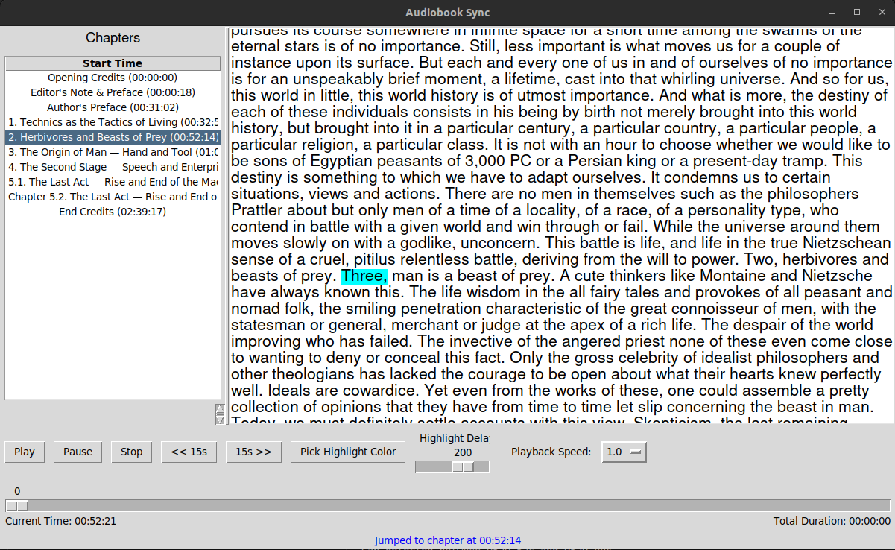

# AudibleHighlights



AudibleHighlights is a tool designed to enhance your reading experience by synchronizing audiobooks with their transcriptions. Utilizing the **Whisper Timestamped** model for accurate audio-to-text transcription, this application highlights the text in real-time as you listen, helping you maintain focus and improve concentration.

## 📖 Features

- **Audio Conversion:** Converts various audio formats (e.g., `.mp3`, `.m4b`) to `.wav` for optimal processing.
- **Accurate Transcription:** Uses the Whisper Timestamped model to transcribe audio files with precise word-level timestamps.
- **Real-Time Highlighting:** Highlights words in the transcript as the audio plays, enhancing concentration and comprehension.
- **Chapter Navigation:** Easily navigate through chapters with synchronized audio playback.
- **Customizable Highlighting:** Choose your preferred highlight colors and adjust synchronization delays to suit your preferences.

## 🚀 Installation

### 1. Clone the Repository

```bash
git clone https://github.com/yourusername/AudibleHighlights.git
cd AudibleHighlights
```

### 2. Set Up a Virtual Environment (Recommended)

It's highly recommended to use a **virtual environment** to manage your project's dependencies.

```bash
python -m venv venv
```

#### Activate the Virtual Environment:

- **On macOS/Linux:**

  ```bash
  source venv/bin/activate
  ```

- **On Windows:**

  ```bash
  venv\Scripts\activate
  ```

### 3. Install Python Dependencies

```bash
pip install -r requirements.txt
```

### 4. Install System Dependencies

#### **FFmpeg**

Required by `pydub` for audio conversions.

- **Ubuntu/Debian:**

  ```bash
  sudo apt update
  sudo apt install ffmpeg
  ```

- **macOS (using Homebrew):**

  ```bash
  brew install ffmpeg
  ```

- **Windows:**

  - Download FFmpeg from the [official website](https://ffmpeg.org/download.html).
  - Follow the installation instructions provided there.

#### **VLC Media Player**

Required by `python-vlc` for audio playback.

- Download and install VLC from the [official website](https://www.videolan.org/vlc/).

## 🛠 Usage

### 1. Add Your Audiobook Files

Place your audiobook files (e.g., `.m4b`, `.mp3`) directly inside the `input` folder. **Do not** create subdirectories within `input`.

```
AudibleHighlights/
├── input/
│   ├── YourBook1.m4b
│   ├── YourBook2.mp3
│   └── ...
├── output/
├── assets/
│   └── img.png
├── transcribe.py
├── display.py
├── requirements.txt
└── .gitignore
```

### 2. Transcribe Audiobook Files

Run the transcription script to convert and transcribe your audio files.

```bash
python transcribe.py
```

**What This Does:**

- **Audio Conversion:** Converts each audio file in the `input` folder to `.wav` format.
- **Transcription:** Uses the Whisper Timestamped model to transcribe the `.wav` files, generating corresponding `.txt` and `.json` files in the `output` folder.

**Note:** Ensure that your system has sufficient resources, especially if processing large or multiple audio files.

### 3. Configure the Display Application

Before launching the GUI to view and interact with your transcriptions, you need to specify which audiobook to display.

1. Open `display.py` in a text editor.
2. Locate the following lines in the `main()` function:

   ```python
   audio_file_path = "input/path/to/.m4b"
   json_file_path = "output/path/to/.json"
   ```

3. Replace the placeholder paths with the actual paths to your desired audiobook and its transcription JSON file.

**Example:**

```python
audio_file_path = "output/YourBook1/YourBook1.m4b"
json_file_path = "output/YourBook1/YourBook1.json"
```

### 4. Launch the Display Application

Run the display script to launch the GUI.

```bash
python display.py
```

**What This Does:**

- **GUI Interface:** Opens a window displaying the transcribed text with synchronized highlighting.
- **Playback Controls:** Play, pause, stop, skip forward/backward, adjust playback speed, and more.
- **Chapter Navigation:** Easily jump to specific chapters within the audiobook.

## 📂 Repository Structure

```
AudibleHighlights/
├── input/
│   ├── YourBook1.m4b
│   ├── YourBook2.mp3
│   └── ...
├── output/
│   ├── YourBook1/
│   │   ├── YourBook1.wav
│   │   ├── YourBook1.txt
│   │   └── YourBook1.json
│   ├── YourBook2/
│   │   ├── YourBook2.wav
│   │   ├── YourBook2.txt
│   │   └── YourBook2.json
│   └── ...
├── assets/
│   └── img.png
├── transcribe.py
├── display.py
├── requirements.txt
└── .gitignore
```

- **`input/`**: Place your original audiobook files here.
- **`output/`**: Contains subdirectories for each audiobook with converted and transcribed files.
- **`assets/`**: Stores images and other media files used in the project.
- **`transcribe.py`**: Script to convert and transcribe audio files.
- **`display.py`**: GUI application to view and interact with transcriptions.
- **`requirements.txt`**: Lists all Python dependencies.
- **`.gitignore`**: Ensures `input` and `output` folders are tracked but remain empty in the repository.

## 🛡 License

This project is licensed under the [MIT License](LICENSE).

## 🤝 Contributing

Contributions are welcome! Please open an issue or submit a pull request for any improvements or bug fixes.

## 📧 Contact

For any questions or suggestions, feel free to reach out at [mateogon97@hotmail.com](mailto:mateogon97@hotmail.com).

---

_Enhance your reading and listening experience with AudibleHighlights!_
